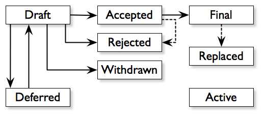

.. _dep-0001:

DEP 1 - DEP Purpose and Guidelines
==================================

:DEP:          1
:Title:        DEP Purpose and Guidelines
:Author:       Maciej Delmanowski
:Status:       Active
:Type:         Process
:Created:      2018-04-19
:Post-History: none

What is a DEP?
--------------

DEP stands for DebOps Enhancement Proposal. A DEP is a design
document providing information to the DebOps community, or describing
a new feature for DebOps or its processes or environment. The DEP
should provide a concise technical specification of the feature and a
rationale for the feature.

We intend DEPs to be the primary mechanisms for proposing major new
features, for collecting community input on an issue, and for
documenting the design decisions that have gone into DebOps. The DEP
author is responsible for building consensus within the community and
documenting dissenting opinions.

Because the DEPs are maintained as text files in a versioned
repository, their revision history is the historical record of the
feature proposal [1]_.

DEPs are modeled after similar concept popularized by the
`Python Enhancement Proposals`__ (PEPs).

.. __: https://www.python.org/dev/peps/pep-0001/

DEP Types
---------

There are three kinds of DEP:

1. A **Standards Track** DEP describes a new feature or implementation for
   DebOps. It may also describe an interoperability standard that will be
   supported outside the standard DebOps environment for current DebOps
   versions before a subsequent DEP adds standard environment support in
   a future version.

2. An **Informational** DEP describes a DebOps design issue, or
   provides general guidelines or information to the DebOps community,
   but does not propose a new feature. Informational DEPs do not
   necessarily represent a DebOps community consensus or
   recommendation, so users and implementers are free to ignore
   Informational DEPs or follow their advice.

3. A **Process** DEP describes a process surrounding DebOps, or
   proposes a change to (or an event in) a process.  Process DEPs are
   like Standards Track DEPs but apply to areas other than the DebOps
   source code itself. They may propose an implementation, but not to
   DebOps's codebase; they often require community consensus; unlike
   Informational DEPs, they are more than recommendations, and users
   are typically not free to ignore them.  Examples include
   procedures, guidelines, changes to the decision-making process, and
   changes to the tools or environment used in DebOps development.
   Any meta-DEP is also considered a Process DEP.

DEP Workflow
------------

DebOps maintainers
~~~~~~~~~~~~~~~~~~

There are several references in the DEP to the "DebOps maintainers". Original
creator and maintainer of DebOps is Maciej Delmanowski. There are a few other
people currently active in DebOps development, you can see the list of
contributors at: https://github.com/debops/debops/graphs/contributors.

DEP Editors
~~~~~~~~~~~

The DEP editors are individuals responsible for managing the administrative
and editorial aspects of the DEP workflow (e.g. assigning DEP numbers and
changing their status).  See `DEP Editor Responsibilities & Workflow`_ for
details. The current editors are:

- Maciej Delmanowski

DEP editorship is by invitation of the current editors. All of the DEP workflow
can be conducted via the GitHub `DebOps monorepo`_ issues and pull requests.

Start with an idea for DebOps
~~~~~~~~~~~~~~~~~~~~~~~~~~~~~

The DEP process begins with a new idea for DebOps. It is highly
recommended that a single DEP contains a single key proposal or new
idea. Small enhancements or patches often don't need
a DEP and can be injected into the DebOps development workflow with a
patch submission to the `DebOps issue tracker`_. The more focused the
DEP, the more successful it tends to be. The DEP editors reserve the
right to reject DEP proposals if they appear too unfocused or too
broad. If in doubt, split your DEP into several well-focused ones.

Each DEP must have a champion -- someone who writes the DEP using the style and
format described below, shepherds the discussions in the appropriate forums,
and attempts to build community consensus around the idea. The DEP champion
(a.k.a. Author) should first attempt to ascertain whether the idea is DEP-able.
Posting to the <debops-users@lists.debops.org> mailing list is the best way to
go about this.

Vetting an idea publicly before going as far as writing a DEP is meant
to save the potential author time. Many ideas have been brought
forward for changing DebOps that have been rejected for various
reasons [2]_. Asking the DebOps community first if an idea is original
helps prevent too much time being spent on something that is
guaranteed to be rejected based on prior discussions (searching
the Internet does not always do the trick). It also helps to make sure
the idea is applicable to the entire community and not just the author.
Just because an idea sounds good to the author does not
mean it will work for most people in most areas where DebOps is used.

Once the champion has asked the DebOps community as to whether an idea has any
chance of acceptance, a draft DEP should be presented to the DebOps mailing
list. This gives the author a chance to flesh out the draft DEP to make
properly formatted, of high quality, and to address initial concerns about the
proposal.

At this stage the DEP author should ask the DEP editors for assignment
of a DEP number and type (Standards Track, Informational or Process).
The assignment will be recorded in :ref:`DEP 0 <dep-0000>` with the
"Reserved" status. This allows the DEP author to create a GPG-signed
commit which can then be later merged into the repository with the final
DEP number and type without any additional changes, preserving the
signature.

If during that time the DEP proposal will be withdrawn, the reservation
will be removed and the given DEP number will be free to use again.

Submitting a DEP
~~~~~~~~~~~~~~~~

Following a discussion on the DebOps mailing list, the proposal should be
submitted as a draft DEP via a `GitHub pull request`_. The draft must be
written in DEP style as described below, else it will fail review immediately
(although minor errors may be corrected by the editors).

The standard DEP workflow is:

- You, the DEP author, fork the `DebOps monorepo`_, and create a file
  named :file:`docs/dep/dep-<number>.rst` that contains your new DEP.
  Use the number and type reserved for your draft DEP by the editors.
  Remember to commit the DEP with the status "Draft". Multiple commits
  created during preparation can be squashed into a single final commit.
- Push this to your GitHub fork and submit a pull request.
- The DEP editors review your PR for structure, formatting, and other
  errors.

Once the review process is complete, and the DEP editors approve it
(note that this is *not* the same as accepting your DEP!), they will
merge your pull request onto master. The reservation in DEP 0 will be
moved into the correct place on the list of recorded DEPs.

The DEP editors will not unreasonably deny a DEP. Reasons for denying DEP
status include duplication of effort, being technically unsound, not providing
proper motivation or addressing backwards compatibility, or not in keeping
with the :ref:`DebOps philosophy <philosophy>`. The DebOps maintainers can be
consulted during the approval phase, and are the final arbiters of the draft's
DEP-ability.

Developers with :command:`git push` privileges for the `DebOps monorepo`_ may
claim DEP numbers directly by creating and committing a new DEP. When doing so,
the developer must handle the tasks that would normally be taken care of by the
DEP editors (see `DEP Editor Responsibilities & Workflow`_). This includes
ensuring the initial version meets the expected standards for submitting a DEP.
Alternately, even developers may choose to submit DEPs via pull request.  When
doing so, let the DEP editors know you have :command:`git push` privileges and
they can guide you through the process of updating the DEP repository directly.

As updates are necessary, the DEP author can check in new versions if they
(or a collaborating developer) have :command:`git push` privileges.

After a DEP number has been assigned, a draft DEP may be discussed further on
the DebOps mailing list (getting a DEP number assigned early can be useful for
ease of reference, especially when multiple draft DEPs are being considered at
the same time). Eventually, all Standards Track DEPs must be sent to the
`debops-users list <mailto:debops-users@lists.debops.org>`__ for review as
described in the next section.

Standards Track DEPs consist of two parts, a design document and a
reference implementation. It is generally recommended that at least a
prototype implementation be co-developed with the DEP, as ideas that sound
good in principle sometimes turn out to be impractical when put to the
test of implementation.

DEP authors are responsible for collecting community feedback on a DEP before
submitting it for review. However, wherever possible, long open-ended
discussions on public mailing lists should be avoided. Strategies to keep the
discussions efficient include: having the DEP author accept private comments in
the early design phases, setting up a wiki page, etc. DEP authors should use
their discretion here.

DEP Review & Resolution
~~~~~~~~~~~~~~~~~~~~~~~

Once the authors have completed a DEP, they may request a review for style and
consistency from the DEP editors. However, the content and final acceptance of
the DEP must be requested of the DebOps maintainers, usually via an email to
the debops-users mailing list. DEPs are reviewed by the DebOps maintainers and
their chosen consultants, who may accept or reject a DEP or send it back to the
author(s) for revision. For a DEP that is predetermined to be acceptable (e.g.,
it is an obvious win as-is and/or its implementation has already been checked
in) the DebOps maintainers may also initiate a DEP review, first notifying the
DEP author(s) and giving them a chance to make revisions.

The final authority for DEP approval are the DebOps maintainers. However,
whenever a new DEP is put forward, any core developer that believes they are
suitably experienced to make the final decision on that DEP may offer to serve
as the DebOps maintainers delegate (or "DEP czar") for that DEP. If their
self-nomination is accepted by the other core developers and the DebOps
maintainers, then they will have the authority to approve (or reject) that DEP.
This process happens most frequently with DEPs where the DebOps maintainers
have granted in principle approval for *something* to be done, but there are
details that need to be worked out before the DEP can be accepted.

If the final decision on a DEP is to be made by a delegate rather than directly
by the DebOps maintainers, this will be recorded by including the
"DebOps-Delegate" header in the DEP.

DEP review and resolution may also occur on a list other than debops-users. In
this case, the "Discussions-To" heading in the DEP will identify the
appropriate alternative list where discussion, review and pronouncement on the
DEP will occur.

For a DEP to be accepted it must meet certain minimum criteria. It must be
a clear and complete description of the proposed enhancement. The enhancement
must represent a net improvement. The proposed implementation, if applicable,
must be solid and must not complicate the codebase unduly. Finally, a proposed
enhancement must be "debopsy" in order to be accepted by the DebOps
maintainers. (However, "debopsy" is an imprecise term; it may be defined as
whatever is acceptable to the DebOps maintainers. This logic is intentionally
circular.).

Once a DEP has been accepted, the reference implementation must be
completed. When the reference implementation is complete and incorporated
into the main source code repository, the status will be changed to "Final".

A DEP can also be assigned status "Deferred". The DEP author or an
editor can assign the DEP this status when no progress is being made
on the DEP. Once a DEP is deferred, a DEP editor can re-assign it
to draft status.

A DEP can also be "Rejected". Perhaps after all is said and done it
was not a good idea. It is still important to have a record of this
fact. The "Withdrawn" status is similar - it means that the DEP author
themselves has decided that the DEP is actually a bad idea, or has
accepted that a competing proposal is a better alternative.

When a DEP is Accepted, Rejected or Withdrawn, the DEP should be updated
accordingly. In addition to updating the status field, at the very least
the Resolution header should be added with a link to the relevant post
in the debops-users mailing list archives.

DEPs can also be superseded by a different DEP, rendering the original
obsolete. This is intended for Informational DEPs, where version 2 of
an API can replace version 1.

The possible paths of the status of DEPs are as follows:

Some Informational and Process DEPs may also have a status of "Active"
if they are never meant to be completed. E.g. DEP 1 (this DEP).

DEP Maintenance
~~~~~~~~~~~~~~~

In general, Standards track DEPs are no longer modified after they have reached
the Final state. Once a DEP has been completed, the Language and standard
environment references become the formal documentation of the expected
behavior.

Informational and Process DEPs may be updated over time to reflect changes
to development practices and other details. The precise process followed in
these cases will depend on the nature and purpose of the DEP being updated.

What belongs in a successful DEP?
---------------------------------

Each DEP should have the following parts:

1. Preamble -- reStructuredText field list style headers containing
   meta-data about the DEP, including the DEP number, a short
   descriptive title (limited to a maximum of 44 characters), the names,
   and optionally the contact info for each author, etc.

2. Abstract -- a short (~200 word) description of the technical issue
   being addressed.

3. Copyright/public domain -- Each DEP must either be explicitly labeled as
   placed in the public domain or licensed under the
   `GNU General Public License v3`_.

4. Specification -- The technical specification should describe the
   syntax and semantics of any new project feature. The importance of various
   specification details can be emphasised by usage of the capitalized key
   words, as described in `BCP 14`__.

   The key words "MUST", "MUST NOT", "REQUIRED", "SHALL", "SHALL
   NOT", "SHOULD", "SHOULD NOT", "RECOMMENDED", "NOT RECOMMENDED",
   "MAY", and "OPTIONAL" when used in DEPs, are to be interpreted as
   described in BCP 14 [RFC2119] [RFC8174] when, and only when, they
   appear in all capitals, as shown here.

   .. __: https://tools.ietf.org/html/bcp14

5. Motivation -- The motivation is critical for DEPs that want to change the
   DebOps project. It should clearly explain why the existing project feature
   is inadequate to address the problem that the DEP solves. DEP submissions
   without sufficient motivation may be rejected outright.

6. Rationale -- The rationale fleshes out the specification by describing what
   motivated the design and why particular design decisions were made. It
   should describe alternate designs that were considered and related work,
   e.g. how the feature is supported in other projects.

   The rationale should provide evidence of consensus within the
   community and discuss important objections or concerns raised
   during discussion.

7. Backwards Compatibility -- All DEPs that introduce backwards
   incompatibilities must include a section describing these incompatibilities
   and their severity. The DEP must explain how the author proposes to deal
   with these incompatibilities. DEP submissions without a sufficient backwards
   compatibility treatise may be rejected outright.

8. Reference Implementation -- The reference implementation must be
   completed before any DEP is given status "Final", but it does not
   need to be completed before the DEP is accepted. While there is merit
   to the approach of reaching consensus on the specification and
   rationale before writing code, the principle of "rough consensus and
   running code" is still useful when it comes to resolving many
   discussions of API details.

   The final implementation must include test code and documentation
   appropriate for either the DebOps code reference or the
   standard environment reference.

DEP Formats and Templates
-------------------------

DEPs are UTF-8 encoded text files using the reStructuredText_ format.
ReStructuredText_ allows for rich markup that is still quite easy to
read, but also results in good-looking and functional HTML.
:ref:`DEP 12 <dep-0012>` contains instructions and a template for
reStructuredText DEPs.

A Sphinx-based documentation implemented in the DebOps monorepo automatically
converts DEPs to HTML for viewing on the web. The conversion of
reStructuredText DEPs is handled by the Docutils_ module.

DEP Header Preamble
-------------------

Each DEP must begin with a named reference used in internal
documentation and a document title, which will be present in the
rendered HTML page:

.. code-block:: rst

   .. _dep-<dep number>:

   DEP <dep number> - <dep title>
   ==============================

The next section should be a reStructuredText field list style header
preamble. The headers must appear in the following order. Headers marked
with "*" are optional and are described below. All other headers are
required.

.. code-block:: rst

    :DEP:             <dep number>
    :Title:           <dep title>
    :Author:          <list of authors' real names and optionally, email addrs>
  * :DebOps-Delegate: <DEP czar's real name>
  * :Discussions-To:  <email address>
    :Status: <Draft | Active | Accepted | Deferred | Rejected |
             Withdrawn | Final | Superseded>
    :Type:   <Standards Track | Informational | Process>
  * :Requires:        <dep numbers>
    :Created:         <date created on, in yyyy-mm-dd format>
  * :DebOps-Version:  <version number>
    :Post-History:    <dates of postings to debops-users>
  * :Replaces:        <dep number>
  * :Superseded-By:   <dep number>
  * :Resolution:      <url>

The Author header lists the names, and optionally the email addresses
of all the authors/owners of the DEP. The format of the Author header
value must be

    Random J. User <address@dom.ain>

if the email address is included, and just

    Random J. User

if the address is not given.

If there are multiple authors, they can be specified separated by a comma, or
each can be on a separate line following RFC 2822 continuation line
conventions.

The DebOps-Delegate field is used to record cases where the final decision to
approve or reject a DEP rests with someone other than the DebOps maintainers.

.. note:: The Resolution header is required for Standards Track DEPs
   only. It contains a URL that should point to an email message or
   other web resource where the pronouncement about the DEP is made.*

For a DEP where final pronouncement will be made on a list other than
debops-users, a Discussions-To header will indicate the mailing list
or URL where the pronouncement will occur. A temporary Discussions-To header
may also be used when a draft DEP is being discussed prior to submission for
pronouncement. No Discussions-To header is necessary if the DEP is being
discussed privately with the author, or on the debops-users mailing list.

The Type header specifies the type of DEP: Standards Track,
Informational, or Process.

The Created header records the date that the DEP was assigned a
number, while Post-History is used to record the dates of when new
versions of the DEP are posted to debops-users. Both
headers MUST be in yyyy-mm-dd format, e.g. 2001-08-14.

Standards Track DEPs will typically have a DebOps-Version header which
indicates the version of DebOps that the feature will be released with.
Standards Track DEPs without a DebOps-Version header indicate interoperability
standards that will initially be supported through external libraries and
tools, and then supplemented by a later DEP to add support to the standard
environment. Informational and Process DEPs do not need a DebOps-Version
header.

DEPs may have a Requires header, indicating the DEP numbers that this
DEP depends on.

DEPs may also have a Superseded-By header indicating that a DEP has
been rendered obsolete by a later document; the value is the number of
the DEP that replaces the current document. The newer DEP must have a
Replaces header containing the number of the DEP that it rendered
obsolete.

Auxiliary Files
---------------

DEPs may include auxiliary files such as diagrams.  Such files must be named
:file:`docs/dep/dep-XXXX-Y.ext`, where "XXXX" is the DEP number, "Y" is
a serial number (starting at 1), and "ext" is replaced by the actual file
extension (e.g. "png").

Reporting DEP Bugs, or Submitting DEP Updates
---------------------------------------------

How you report a bug, or submit a DEP update depends on several
factors, such as the maturity of the DEP, the preferences of the DEP
author, and the nature of your comments. For the early draft stages
of the DEP, it's probably best to send your comments and changes
directly to the DEP author. For more mature, or finished DEPs you may
want to submit corrections to the `DebOps issue tracker`_ so that your changes
don't get lost. If the DEP author is a DebOps developer, assign the bug/patch
to them, otherwise assign it to a DEP editor.

When in doubt about where to send your changes, please check first
with the DEP author and/or a DEP editor.

DEP authors with :command:`git push` privileges for the DEP repository can
update the DEPs themselves by using :command:`git push` to submit their
changes.

Transferring DEP Ownership
--------------------------

It occasionally becomes necessary to transfer ownership of DEPs to a
new champion. In general, it is preferable to retain the original author as
a co-author of the transferred DEP, but that's really up to the
original author. A good reason to transfer ownership is because the
original author no longer has the time or interest in updating it or
following through with the DEP process, or has fallen off the face of
the 'net (i.e. is unreachable or not responding to email). A bad
reason to transfer ownership is because the author doesn't agree with the
direction of the DEP. One aim of the DEP process is to try to build
consensus around a DEP, but if that's not possible, an author can always
submit a competing DEP.

If you are interested in taking over ownership of a DEP, you can also do this via
pull request. Fork the `DebOps monorepo`_, make your ownership modification,
and submit a pull request. You should also send a message asking to take over,
addressed to both the original author and the DEP editors. If the original
author doesn't respond to email in a timely manner, the DEP editors will make
a unilateral decision (it's not like such decisions can't be reversed :).

DEP Editor Responsibilities & Workflow
--------------------------------------

A DEP editor must subscribe to the <debops-users@lists.debops.org> list and
must watch the `DebOps monorepo`_. Most correspondence regarding DEP
administration can be handled through GitHub issues and pull requests.

For each new DEP that comes in, an editor does the following:

- Read the DEP to check if it is ready (sound and complete).  The ideas
  must make technical sense, even if they don't seem likely to be
  accepted.

- The title should accurately describe the content.

- Edit the DEP for language (spelling, grammar, sentence structure, etc.),
  markup, code style.

If the DEP isn't ready, an editor will send it back to the author for
revision, with specific instructions.

Once the DEP is ready for the repository, a DEP editor will:

* Assign a DEP number (almost always just the next available number,
  but sometimes it's a special/joke number, like 666 or 3141).
  Remember that numbers below 100 are meta-DEPs.

* Add the DEP to a local fork of the DEP repository.  For workflow
  instructions, follow the DebOps Developers Guide (to be written).

  The git repo for the DEPs is::

   https://github.com/debops/debops

* Run :command:`make docs` to ensure that the documentation is generated
  without errors. If any errors occur, then the web site will not be updated to
  reflect the DEP changes.

* Commit and push the new (or updated) DEP.

* Monitor https://docs.debops.org/ to make sure the DEP gets added to the site
  properly.  If it fails to appear, running :command:`make docs` will build all
  of the current DEPs. If any of these are triggering errors, they must be
  corrected before any DEP will update on the site.

* Send email back to the DEP author with next steps (post to
  debops-users mailing list).

Updates to existing DEPs should be submitted as a `GitHub pull request`_.
Questions may of course still be sent to <debops-users@lists.debops.org>.

Many DEPs are written and maintained by developers with write access to the
DebOps codebase. The DEP editors monitor the DebOps monorepo for DEP changes,
and correct any structure, grammar, spelling, or markup mistakes they see.

DEP editors don't pass judgment on DEPs. They merely do the administrative
& editorial part (which is generally a low volume task).

.. _DebOps monorepo: https://github.com/debops/debops

.. _DebOps issue tracker: https://github.com/debops/debops/issues

.. _GNU General Public License v3: https://www.gnu.org/licenses/gpl-3.0.en.html

.. _reStructuredText: http://docutils.sourceforge.net/rst.html

.. _Docutils: http://docutils.sourceforge.net/

.. _`GitHub pull request`: https://github.com/debops/debops/pulls

.. rubric:: Footnotes

.. [1] This historical record is available by the normal :command:`git`
   commands for retrieving older revisions, and can also be browsed via HTTP
   here: https://github.com/debops/debops

.. [2] Well, not yet, but maybe when the project will be a few years older...

Copyright
---------

.. code-block:: none

   Copyright (C) 2018 Maciej Delmanowski <drybjed@gmail.com>
   Copyright (C) 2018 DebOps https://debops.org/

   This document is part of DebOps.

   DebOps is free software; you can redistribute it and/or modify
   it under the terms of the GNU General Public License version 3, as
   published by the Free Software Foundation.

   DebOps is distributed in the hope that it will be useful,
   but WITHOUT ANY WARRANTY; without even the implied warranty of
   MERCHANTABILITY or FITNESS FOR A PARTICULAR PURPOSE.  See the
   GNU General Public License for more details.

   You should have received a copy of the GNU General Public License
   along with DebOps. If not, see https://www.gnu.org/licenses/.

..
   vim: tw=72:
